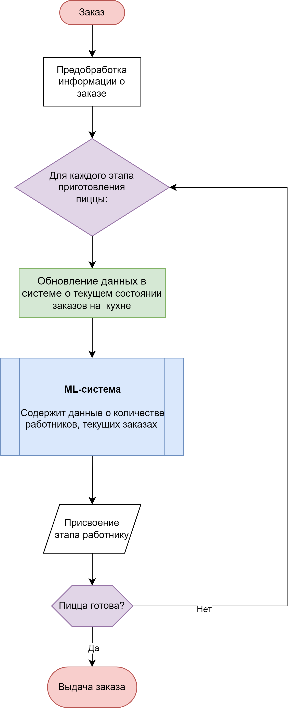
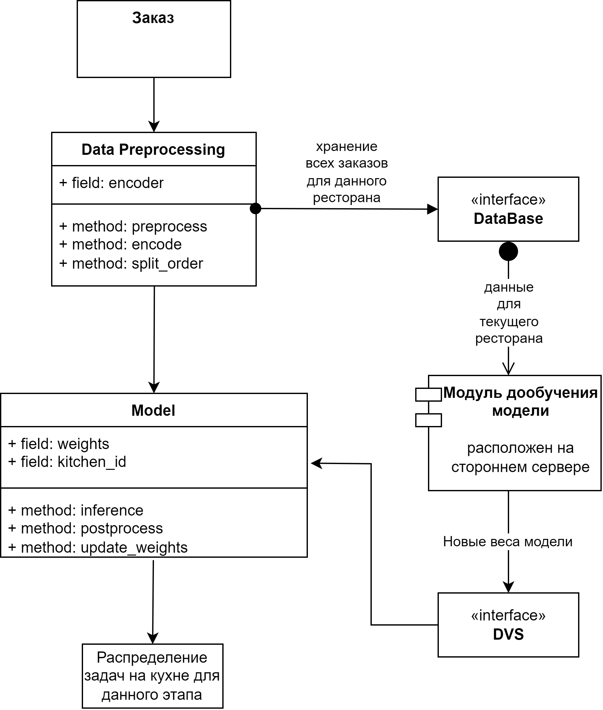

# Проектирование системы оптимизации производства пиццы при помощи ИИ
**Цель бизнеса**: увеличить эффективность производства пиццы в сети ресторанов, сократив время приготовления и улучшив качество продукции.

**Цель задания**: разработать документацию по требованиям и дизайну для системы оптимизации производства пиццы в сети ресторанов.

## 1 Формулирование требований
* В процессе приготовления пиццы в ресторане каждое действие фиксируется системой. Можно в имеющуюся систему внедрить более точное разделение на действия: нарезка начинки, приготовление теста, сборка, выпекание (в случае, если подобного разделения нет) и на основе этих данных строить модель
* Присвоить к имеющимся в системе действиям идентификацию по повару, который это действие выполнял
* Бизнес-цели: уменьшить время приготовления пиццы, оптимизировать труд работников кухни

### Функциональные требования:
* Работа в реальном времени: обновление при поступлении каждого нового заказа
* Адаптация к количеству работников на кухне
* Обучение на массиве данных, полученном со всех ресторанов сети, но после выхода в прод - дообучение для каждого ресторана по отдельности (имеет смысл, так как за счет своего местоположения, времени года и прочих факторов рестораны обрабатывают разное число заказов)

### Нефункциональные требования:
* Система должна легко разворачиваться в каждом новом заведении
* Система должна уметь реагировать на выбросы в данных (т. е. дни с неожиданно большим наплывом клиентов или наоборот, их отсутствием)
* Стоимость развертывания системы в новом ресторане должна составлять не более 10% от остальных затрат

 
# 2 ML Design Doc
**Постановка задачи:** модель решает задачу регрессии для распределения задач на кухне при данном её состоянии. Под состоянием подразумевается количесество поваров, заказов, статус выполнения каждого заказа.

В системе будут созданы интерфейсы для взаимодействия с базой данных и системой хранения весов. 
Общая архитектура системы представлена на следующей диаграмме.

Для оптимизации производственного процесса будут использоваться алгоритм регрессии. Он позволяет вычислить вероятности распределения выполнения той или иной задачи для каждого работника для достижения наибольшей оптимальности процессов.

## Инструменты и технологии
* При разработке модели будет использоваться язык программирования Python, основные библиотеки - PyTorch. Для визуализации данных и разведочного анализа используется стек Pandas, SKlearn, MatPlotLib.

* Для ускорения работы модели будет проведено дополниельное исследование и выбран наилучший стек из вариантов: ONNX, Triton, TensorRT.

* Для визуализации процесса обучения модели будет использован MLFlow, так как его легко развернуть независимо на своем устройстве. 

* База данных заказов организована следующим образом: для хранения заказов используется PotgreSQL с возможностью поддержки JSON (на тот случай, если произойдут изменения в структуре заказов). Для хранения логов используется Redis.

# 3 Разработка диаграмм
## 3.1 Диаграмма потока данных в производственном процессе

На диаграмме представлен поток данных в системе. После поступления заказа выполняется его предобработка и конвертация данных в формат, подходящий для модели. Заказ разбивается на эапы в приготовлении, в соответствии с технологической картой. Для каждого этапа приготовления обновляются данные в модели, система обрабатывает данные, присваивает этап работнику. Затем выполняется проверка, закончено ли выполнение пиццы, если да - заказ выдается и закрывается, иначе - продолжается работа. 

Также данные передаются для дообучения модели, но так как это не относится к производственному процессу, то не отображается на данной схеме.

## 3.2 Диаграмма классов

На диаграмме классов представлена структура и взаимодействие компонентов машинного обучения. Данные по заказу проходят препроцессинг (выполняется классом `Data Preprocessing`, в нем инкапсулирован препроцессинг и энкодер для категориальных данных). Данные передаются в базу данных, хранящую заказы для данного ресторана.

После препроцессинга данные о каждом этапе приготовления передаются в модель для инференса, результат - распределение задач на кухне. 

Также в системе есть модуль дообучения модели. Он расположен на стороннем сервере, чтобы не расходовать ресурсы в ресторане. Он связан с базой данных для ресторана, а также с системой хранения весов (DVS). После накопления некого пула данных, модель выполняет дообучение на этих данных и обновляет веса. 

# 4 Проектирование архитектуры

Интеграция выполняется в имеющуюся систему заказов. Для этого будет использоваться имеющаяся архитектура с добавлением слоя инференса модели и передачи данных в системы хранения.
